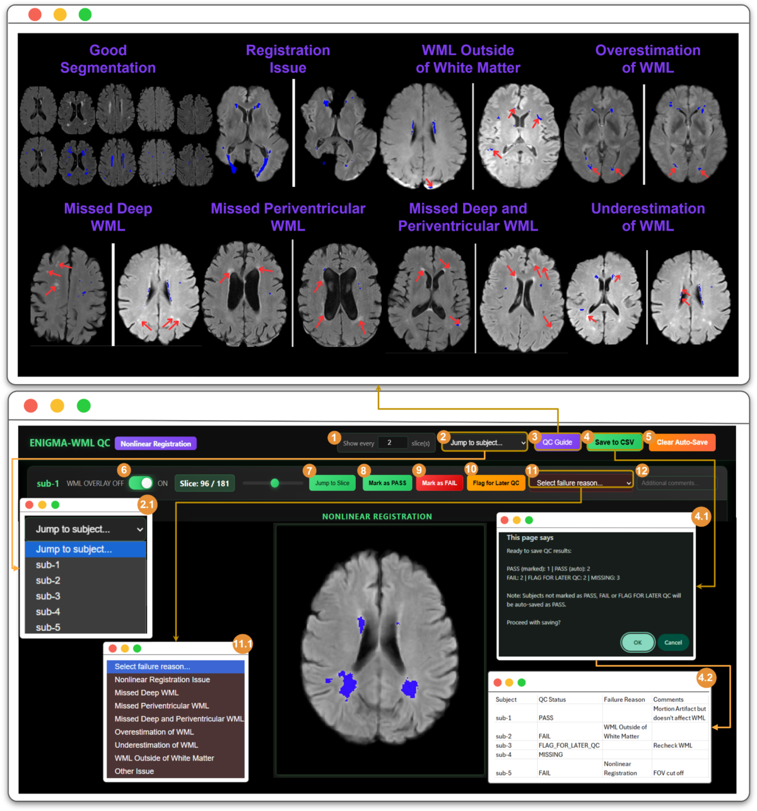

# Quality Control for WML Pipeline

As with any automated pipeline, some form of manual quality control (QC) step is required to ensure the pipeline has
performed correctly and the outputs generated are adequate for further analysis. To make this process as efficient as
possible, our pipeline uses a 2-step framework that transforms NIfTI volumes into an interactive, browser-based HTML
interface. [See the QC pipeline docs](./qc_pipeline.py) for technical details of how this process works.

This approach enables visual examination of white matter lesion (WML) segmentations by overlaying the WML masks
(rendered in solid blue) onto FLAIR images registered to MNI standard space. Both linear and nonlinear registration
outputs can be reviewed in the HTMLs.

## The HTML files

HTML files are produced under `derivatives/enigma-pd-wml/QC` by the pipeline, and allow interactive browsing and
assessment of the output images for all subjects and sessions.

>[!IMPORTANT]
> If you are running the enigma-pd-wml pipeline multiple times with different datasets, make sure you have set the
> `-h` option appropriately (see the [options section of the readme](../README.md#options) for more details). Without
> this, HTML files from different datasets may overwrite each other's progress.

This directory will contain at least one html file for `Linear` results (named similar to
`dataset_1_ENIGMA_WML_QC_Linear_01.html`) and one for `Nonlinear` results (named similar to
`dataset_1_ENIGMA_WML_QC_Nonlinear_01.html`). If you had many subjects / sessions in your input data, you may see
further html files ending in `_02`, `_03` etc. - each file will contain a maximum of 200 scans.

Double click on an html file to open it in your default web browser.

## QC features

A series of subject / session images are displayed per `.html` file - scroll down to see all available outputs.

See the figure below for a description of the interface (labels described below):

### Slice navigation

Browse through all 182 axial slices via:

- `7` (left): The slice navigation slider - drag to move between slices (the figure above shows slice 96, out of the
  range 0-181)
- `7` (right): `Jump to Slice` button - enter a slice number directly.
- `1` : Slice skip interval selector - e.g. setting to 3 would show every third slice

### Subject and session navigation

Browse to a particular subject / session:

- `2`: Jump to subject dropdown. Click to open the dropdown menu (displayed at `2.1`), where you can select your
  subject/session of interest.

Remember that additional subjects / sessions may be present in extra HTML
files in this directory if you had a lot of scans in your input.

### Segmentation display

- `6`: WML overlay toggle - click to show / hide the WML segmentation mask overlay.

### Assessing segmentation quality

The interface provides various features allowing you to assign scans to different 'QC categories'. Scans can be marked
as PASS (i.e. good segmentation), FAIL (i.e. there are problems with the segmentation) or FLAG FOR LATER QC (i.e. an
ambiguous case that needs a second opinion).

To ensure consistency across raters and sites, there is a standard set of
failure categories to choose from when marking a scan as FAIL:

- **Registration issue**: misalignment between FLAIR and MNI space.
- **WML Outside of White Matter**: WML segmentations in gray matter or CSF
- **Overestimation of WML**: segmentation extends beyond true lesion boundaries
- **Missed Deep WML**: undetected lesions in deep white matter
- **Missed Deep and Periventricular WML**: both regions affected
- **Underestimation of WML**: incomplete lesion coverage

Use the QC guide to see examples of all QC categories:

- `3`: QC guide button: opens the QC guide reference panel with example images. Blue overlay indicates WML segmentation;
  red arrows highlight areas of concern.

To assign scans:

- `8`: Mark as PASS button
- `9`: Marks as FAIL button
- `10`: Flag for later QC button - use to defer QC decision for ambiguous cases requiring a second opinion.
- `11`: Failure reason dropdown (required when marking FAIL). `11.1` shows the open menu with all failure categories.
- `12`: Optional free text field for any additional notes

Note: any subjects not marked as PASS/FAIL/Flag for Later QC are considered auto-pass.

## Saving / exporting data

- Data is automatically saved every 30 seconds to the web browser's local storage. This will be restored on page reload
  (within 24 hours).

- Use the 'Clear Auto-Save' button (`5`), to delete previously saved data.

- Use the 'Save to CSV' button (`4`) to export data. Clicking this will open a confirmation dialog (`4.1`) summarising
  QC decisions so far. An example of the exported CSV format is shown in `4.2`: containing Subject ID, QC Status,
  Failure Reason, and Comments columns. Filename defaults to:
  `<html_prefix>_ENIGMA_WML_QC_{Nonlinear/Linear}_YYYY-MM-DD_HH-MM.csv`

Please share the exported `.csv` file with the ENIGMA-PD-WML team.

## Log output

Log output for the creation of the HTML files can be found in the top level `enigma-pd-wml.log` file. Output from
generating the png images displayed in these files is found at the end of each subject/session log e.g. at
`derivatives/enigma-pd-wml/sub-1/ses-1/sub-1_ses-1.log`.
